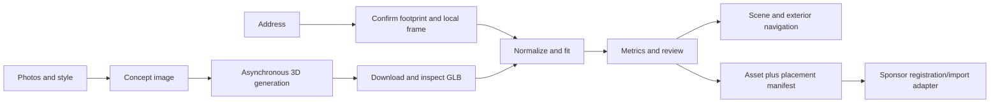

# Feasibility and implementation plan

Review of `spec.md`, 2026-09-19. This is a planning artifact, not an implementation. The repository currently contains the specification and a minimal README; there is no existing pipeline, application, test suite, or integration to build on. Building choice, photos, team size, available hours, API access, and the detailed sponsor integration contract remain unanswered.

**Recommendation:** build one complete, inspectable exterior-building demo around a verified real footprint and a real generated GLB. Make coordinate conversion, fitting, diagnostics, transform export, and exterior navigation dependable. Treat generated geometry as an approximation, expose uncertainty, and retain a cached successful generation for judging. General arbitrary-building reconstruction and automatic world integration are not established by this specification.

## 1. Problems to resolve first

| Priority | Problem | Consequence | Recommended resolution |
| --- | --- | --- | --- |
| P0 | No Procedura bucket, asset-import, or persistent-world API contract | A Three.js viewer and local database do not establish Scorched Nebraska integration | Obtain one accepted input/output example, coordinate conventions, authentication requirements, and a minimal round-trip registration/import test |
| P0 | No selected building, usable photos, or actual generation result | Geometry quality is the largest untested dependency | Select a detached, mostly rectangular building with visible corners; generate and download a textured GLB immediately |
| P0 | “Retaining architectural geometry” is stronger than the proposed inputs support | Image editing can alter silhouettes; single-image generation invents unobserved structure | Promise recognizable style transfer and measured plan alignment; report height/front/hidden geometry as inferred unless independently established |
| P0 | Bounding-box fit is described as footprint containment | Concavities, courtyards, wings, and holes invalidate that implication | Use the box to initialize; validate the transformed polygon against the actual footprint |
| P0 | Schedule and submission information conflict | The team can miss submission or prepare the wrong demo length | Use 8:00 AM ET Sunday as the conservative submission cutoff; verify the live organizer announcement |
| P1 | A geographic address does not identify exactly one building polygon | The model can be accurately fitted to the wrong building | Show candidate outlines and source IDs; require selection when ambiguous |
| P1 | Base footprint, roof outline, parcel boundary, and visible silhouette are conflated | Metrics and collisions can disagree even when each calculation is correct | Keep these geometries separate and label which one is being fitted |
| P1 | Height, vertical datum, and terrain are unspecified | A plan fit can still produce an implausible height or floating building | Use flat terrain for the demo; obtain a trusted height if available, otherwise disclose inferred height |
| P1 | Heading inferred from IoU alone | A perfect fit may face backward | Add a front-edge/camera-heading hint or explicit orientation review |
| P1 | Non-uniform scale is insufficiently defined | It may distort architecture, omit vertical scaling, or introduce shear during export | Default to uniform scale; apply bounded residual stretch only in canonical building axes |
| P1 | Player collision checks only a point and bounding box | The capsule clips into walls or tunnels through them | Use shape-aware, swept collision against a conservative building obstacle |
| P2 | Optional tracks add separate products and infrastructure | They consume the time needed to finish the main pipeline | Defer until the core submission, demo, and sponsor handoff work |

The official [VTHacks guide](https://vthacks.com/guide) confirms the Procedura photo/address challenge, but does not define its API. It gives three minutes to present and one minute for questions. [Devpost](https://vthacks-14.devpost.com/) lists judging from 10:30 AM–1:00 PM, an 8:00 AM submission requirement, and a conflicting 10:00 AM deadline banner. The specification's 9:00 AM/3–5-minute wording is therefore unsafe to rely on. The detailed sponsor requirements may exist outside these public pages.

## 2. What is feasible

| Capability | Assessment | Demo scope |
| --- | --- | --- |
| Resolve one selected address to a confirmed footprint | Feasible once the local data source is validated | One municipality and a manual ambiguity-selection step |
| Upload baseline photos and generate a style concept | Feasible with a working image API | One preset aesthetic; compare source and concept |
| Generate a textured 3D asset | API capability exists; building quality is unverified | One provider, one successful building, cached result plus resumable fresh jobs |
| Normalize, fit, score, and export | Deterministic engineering work | Uniform fit first; concave failures reported honestly |
| Display footprint, raw/fitted model, and matrix | Straightforward once the spatial contract is fixed | One local scene, meter grid, north arrow, diagnostics |
| Walk around the building | Feasible | Flat ground, opaque building shell, exterior only |
| Walk through rooms, doors, or stairs | Not supported by the proposed geometry/collision model | Defer; generated exterior meshes do not establish navigable interiors |
| Persist provenance and reload the same placement | Feasible locally | Job record, copied artifacts, hashes, exact transform and input snapshots |
| Register/import into sponsor world | Unknown until contract and access are obtained | Adapter with explicit pending/failed/confirmed state |
| Any address, arbitrary footprint, exact architecture | Not justified | Post-hackathon research/product work |

A nonsingular affine transform preserves connectedness and hole topology. It cannot turn a solid box into a courtyard building or create missing wings. Even a concave L-shape cannot be obtained from a convex box by affine fitting. Bad generated geometry requires another asset, reconstruction, or an explicitly different procedural fallback.

## 3. Data and generation decisions

### 3.1 A concrete local GIS starting point

Montgomery County publishes a queryable [building polygon layer](https://maps.montva.com/server/rest/services/nrv911merge/NG911_County_Data/FeatureServer/2). Its metadata exposes `OBJECTID`, `ADDR`, `PLACE`, optional `HT_FT`, and JSON/GeoJSON responses. Its source CRS is WKID 102747 / EPSG:2284, and its geometry has no Z coordinate. The metadata is accessible; a feature-query response and coverage of the chosen building have **not** been verified in this review.

EPSG:2284 uses Virginia South State Plane coordinates in US survey feet; this CRS is also identified in [Virginia Department of Energy guidance](https://energy.virginia.gov/coal/mined-land-repurposing/documents/Memos/27-09.pdf). Treat source coordinates according to their CRS; simply assuming meters introduces about a 3.28× scale error. Do not infer the interpretation or accuracy of `HT_FT` without inspecting actual records and metadata.

Suggested resolution flow:

1. Normalize the entered address/building name and geocode it through the chosen service.
2. Query building polygons in a bounded neighborhood, beginning with a 100 m search radius as a configurable heuristic.
3. Prefer address/feature matches; use containment and distance to rank candidates, not to assert identity.
4. Display the outline over context and resolve ambiguous results before generation.
5. Store the original polygon, feature ID, retrieval time, source URL, CRS, and selection evidence.
6. Validate ring closure, nonzero area, holes, and multipolygon components. Preserve the original before any repair. A repair can change geometry type, so inspect its output; [Shapely's repair documentation](https://shapely.readthedocs.io/en/stable/reference/shapely.make_valid.html) explicitly allows geometry collections and collapsed geometry.

A government-published footprint still has acquisition age and geometric uncertainty. Do not describe it as a survey-grade ground-wall outline without supporting metadata. Open/community footprints may be useful fallbacks, but must retain their actual provenance. A missing footprint should lead to an import/selection/rejection path, never an invented “authoritative” polygon.

### 3.2 Generation provider and quality gate

Use one provider after a real sample succeeds. A candidate is Meshy: its [image editing API](https://docs.meshy.ai/en/api/image-to-image) accepts image references and a prompt, and its [image-to-3D API](https://docs.meshy.ai/en/api/image-to-3d) exposes asynchronous generation. Its [multi-image API](https://docs.meshy.ai/en/api/multi-image-to-3d) accepts 1–4 views of the same object and can return a textured GLB. These are documented capabilities, not evidence of quality for this building. Pin the model and settings that actually pass the sample.

Acquire images that show two facades, roof edges, and the base with minimal vegetation, parked cars, cropping, and perspective extremes. Crop the building and remove the background where possible. Mask/edge/depth conditioning may reduce geometry drift when supported, but a prompt alone is not a geometry constraint. Review window count, roofline, silhouette, and wing placement after styling.

Multiple real views help only if they describe the same structure consistently. Independently restyling each photograph can make the views disagree. Synthetic additional views are model guesses, not additional measurements. Start with one clean three-quarter view if consistent multi-view editing is not already working.

Within the first 60–90 minutes of implementation, require a real sample to pass:

- GLB downloads and opens with its textures.
- Geometry represents a volumetric building, not a facade card or a building fused to a large ground slab.
- The up direction, base, footprint, and principal dimensions can be interpreted.
- No gross missing wings or courtyard topology mismatch for the selected target.
- Asset size and frame rate are acceptable on the judging laptop.

If generation fails: change/crop the sample or use one alternative provider through the same adapter. Do not spend the remaining event tuning many models. A footprint extrusion with facade textures is a useful separately labeled fallback, but it does not fulfill image-to-3D reconstruction and must not be presented as that step succeeding. A geometry-first reconstruction followed by retexturing may preserve shape better, but changes the specified order and should be treated as a scope decision.

As a planning example, the current [Meshy pricing page](https://docs.meshy.ai/en/api/pricing) lists 3–12 credits for image editing and 30 credits for a standard textured Meshy-6/7-family image-to-3D call. Ten such attempts imply roughly 330–420 credits before other operations. Account entitlement and actual dollar cost remain unverified. Record actual latency and cost from the sample rather than assuming generation fits within the presentation. Copy artifacts promptly: [Meshy's retention policy](https://docs.meshy.ai/en/api/asset-retention) states a maximum of three days for ordinary API-generated models.

## 4. Coordinate and geometry contract

All calculations use double precision until rendering. Planar geometry uses **East, North** in meters. Scene coordinates use **X = East, Y = Up, Z = South**, a right-handed frame:

```text
scene = (E, U, -N)
plan  = (scene.x, -scene.z)
```

Standard GeoJSON stores longitude before latitude in degrees; local meter polygons are separate internal data, not geographic GeoJSON. See [RFC 7946](https://datatracker.ietf.org/doc/html/rfc7946#section-4). Keep one shared local origin for the whole scene, including neighbors, collisions, and the player. Separate per-building origins require explicit transforms into that scene frame.

Never perform metric fitting in longitude/latitude degrees. Never treat a Web Mercator rendering coordinate as a true ground meter without the map engine's scale conversion. For example, spherical Mercator's local scale at latitude 37.23° is approximately `sec(37.23°) = 1.26`; that is a material building-size error.

### 4.1 Recommended geodetic conversion

Use a coordinate library for source-CRS → WGS84 → Earth-centered Earth-fixed (ECEF) → local East/North/Up (ENU). Preserve the chosen datum transformation and any reported accuracy/fallback. [PROJ documents this conversion pipeline](https://proj.org/en/stable/operations/conversions/topocentric.html).

For WGS84 latitude φ, longitude λ in radians and ellipsoidal height h:

```text
a = 6378137 m
f = 1 / 298.257223563
e² = f(2-f)
ν = a / sqrt(1 - e² sin²φ)

X = (ν+h) cosφ cosλ
Y = (ν+h) cosφ sinλ
Z = (ν(1-e²)+h) sinφ
```

At a fixed origin `(φ₀, λ₀, h₀)`, let `p₀` be its ECEF position:

```text
B = [ -sinλ₀          cosλ₀          0     ]
    [ -sinφ₀ cosλ₀   -sinφ₀ sinλ₀    cosφ₀ ]
    [  cosφ₀ cosλ₀    cosφ₀ sinλ₀    sinφ₀ ]

(E,N,U)ᵀ = B (pECEF - p₀)

C = [ 1  0  0 ]
    [ 0  0  1 ]
    [ 0 -1  0 ]

scene = C B (pECEF - p₀)
```

Both `B` and `C` are proper rotations. Explicitly set WGS84 when using this pipeline rather than relying on library ellipsoid defaults. For a flat-ground demo, project the footprint to E/N and set scene Y to zero. If true terrain/altitude is unavailable, record `groundMode: flat-assumed` and the height assumption; zero is not a measured site elevation. Orthometric elevations and ellipsoidal heights cannot be silently mixed.

For a verified projected-meter CRS, subtracting a common projected origin is an easier alternative. Its grid north may differ from true north; do not combine its angles with true-north headings without convergence correction. Use one coordinate strategy consistently.

The renderer must receive small local coordinates. Numerical check: float32 spacing at 8,388,608 m is 1 m, versus approximately 0.000122 m at 1,024 m. Keeping global coordinates in float64 metadata and subtracting the origin before GPU upload avoids this avoidable precision loss.

### 4.2 Mesh normalization and base extraction

The [glTF specification](https://registry.khronos.org/glTF/specs/2.0/glTF-2.0.html#coordinate-system-and-units) defines meters and a right-handed Y-up frame. That convention does not mean a generated building has correct real-world dimensions or a reliable facade heading. OBJ import needs an explicit unit/up-axis convention and separate material/texture handling; omit it from the first demo.

Resolve every mesh node's existing transform before taking bounds. A multi-node scene cannot be measured from the first geometry's raw vertices. Keep animation/skinning out of scope or explicitly freeze a documented pose. Define `N` as the source-axis/unit normalization applied to the asset-root frame. Unknown axis metadata needs a review control, not an automatic “longest dimension is up” rule.

Inspect disconnected components, generated ground planes, trees, and debris before using bounds. Removing components solely because they are small can remove legitimate chimneys or wings. Raw `y_min` is valid grounding only after rejecting unwanted geometry and choosing a base policy; a single downward spike otherwise shifts the whole model.

Maintain distinct polygons:

- `Q_fit`: estimated structural wall footprint used for placement scoring.
- `Q_visual`: union of projected triangles of the visible mesh; includes roof overhangs.
- `Q_collision`: conservative projection of geometry occupying the player's height range, or a documented simpler exterior proxy.
- `P`: target building footprint; parcel polygons and neighbor buildings are separate data.

For a clean box-like demo asset, the projected convex hull is an acceptable conservative initial proxy, labeled as such. It is not a faithful courtyard/L-shape footprint. More general extraction should intersect triangles at several low horizontal slices above the chosen base, assemble closed loops, and check their consistency. Merely selecting low vertices misses triangles that cross the slice. Whole-mesh projection can hide courtyards under roofs and should not silently replace a structural base. Unstable or open sections trigger review.

## 5. Fitting mathematics

### 5.1 OBB initialization

Compute the convex hull of a polygon. For each distinct hull-edge orientation α, use:

```text
u = (cosα, sinα)
v = (-sinα, cosα)
L(α) = max(p·u) - min(p·u)
W(α) = max(p·v) - min(p·v)
A(α) = L(α) W(α)
```

Choose the minimum-area rectangle, recover its center from the midpoint of the projection intervals, and keep a consistent axis convention. A hull-edge enumeration is O(h²); true rotating calipers can do the rectangle step in O(h) after the hull. The simple implementation is adequate for small demo polygons, or use a tested library. [Shapely provides a minimum rotated rectangle](https://shapely.readthedocs.io/en/stable/reference/shapely.minimum_rotated_rectangle.html); degenerate line/point outputs must be rejected.

OBB ignores holes and concavity. Square/nearly square or symmetric shapes have ambiguous/unstable orientation. Keep deterministic tie-breaking and explicit ambiguity rather than relying on arbitrary library corner order.

### 5.2 Canonical building frame and yaw

Let `αm` be the mesh OBB's long-axis angle in its `(x,-z)` plane; `αt` is the target angle in East/North. Let `(cx,cz)` be the source OBB center in scene-style coordinates and `yb` the chosen ground height after `N`.

```text
G = T(-cx, -yb, -cz)
K = Ry(-αm) G N

Ry(θ) = [ cosθ  0  sinθ  0 ]
        [ 0     1  0     0 ]
        [-sinθ  0  cosθ  0 ]
        [ 0     0  0     1 ]
```

`K` moves source asset-root coordinates into a canonical, grounded building frame. Positive 90° sends +X/East to −Z/North. This sign check catches a common mirrored-heading error.

Candidate canonical-to-target headings are `βk = αt + kπ/2`, `k = 0..3`. With uniform scale the net source yaw is `βk - αm`; with anisotropic scale preserve the separate canonicalization rotation. If a front direction is supplied as clockwise bearing `b` from North, its East/North vector is `(sin b, cos b)`. Match the actual source front vector, not necessarily its long axis, to that vector.

### 5.3 Uniform scale and the maximum rectangular coverage

At each heading, project the rotated source onto the target OBB axes and measure spans `Lm,k`, `Wm,k`. Recompute these for every candidate; 90° swaps the dimensions. With target spans `Lt`, `Wt` and optional in-box margin `m`:

```text
s₀,k = min((Lt-2m)/Lm,k, (Wt-2m)/Wm,k)
S = diag(s₀,k, s₀,k, s₀,k, 1)
```

Reject zero/negative spans, non-finite numbers, or margins that eliminate the available width. Align box centers to initialize translation. This contains the mesh proxy in the target **OBB**, not necessarily in `P`.

For centered, aligned, filled rectangles with no margin, set `rm=Lm/Wm` and `rt=Lt/Wt`. Uniform containment can achieve at most:

```text
coverage = area(fitted mesh) / area(target)
         = min(rm/rt, rt/rm)
         = exp(-abs(log(rm/rt)))
```

Thus aspect mismatch alone can make a high IoU impossible without distortion. Example: a `2 × 1 × 1` model (length, width, height) fitted into a `30 × 10 m` rectangle gets `s=10`, dimensions `20 × 10 × 10 m`, and coverage/IoU `2/3`. The swapped orientation gets `s=5` and coverage `1/6`. Do not blame the optimizer for these bounds.

### 5.4 Bounded non-uniform scale and height

Default to uniform scale. If residual stretching is enabled, define it relative to the uniform baseline in canonical building axes:

```text
S = diag(s₀ ax, s₀ ay, s₀ az, 1)
```

`(ax,1,az)` is a residual correction; it is not the entire scale. Using total `(sx,1,sz)` on a normalized 1-unit-high model would leave it one meter high even after its footprint grows to tens of meters.

A proposed demo limit is `1 ≤ ax,az ≤ 1.15`, with `ay=1`, plus complete footprint revalidation. This is an adjustable product policy, not a derived architectural tolerance. Report the actual total horizontal anisotropy `κ=max(sx,sz)/min(sx,sz)`. If exact fill needs more than the allowed distortion, preserve proportions and report underfill or reject the asset.

For the example above, filling the rectangle requires `(sx,sy,sz)=(15,10,10)` if preserving the uniformly inferred height. That means `ax=1.5`, outside the proposed limit. Scaling cannot simultaneously guarantee correct width, depth, height, and undistorted proportions when the source proportions disagree with reality.

If independently measured height `Ht` is available and source height is `Hm`, then `sy=Ht/Hm`. Record this as an independent scale choice and display its deviation from the uniform baseline. Without `Ht`, height is inferred from the generated proportions, not recovered from the 2D footprint.

### 5.5 Actual polygon fitting, not box matching

For canonical source polygon `Q`, planar target `P`, translation `t`, yaw β, and horizontal scale `D`:

```text
Q′ = { t + R2(β) D q : q ∈ Q }
I = area(Q′ ∩ P)
IoU = I / (area(Q′) + area(P) - I)
spill = area(Q′ \ P) / area(Q′)
coverage = I / area(P)
```

Also compute maximum exterior distance in meters; a long narrow protrusion may have tiny area while still being unacceptable. Use a small, explicit numerical tolerance in local meters, separately from any tolerance for uncertain GIS data. For exact containment use a topology-aware predicate such as [Shapely `covers`](https://shapely.readthedocs.io/en/stable/reference/shapely.covers.html). Testing vertices alone does not ensure that edges stay inside a concave polygon or avoid holes.

Concrete failure of the spec: let `P` be a `10 × 10 m` square with its upper-right `6 × 6 m` corner removed. Its OBB remains `10 × 10 m`. Fitting a full square to that OBB gives target area `64 m²`, IoU `0.64`, and **36% of model area outside the footprint**. The OBB center `(5,5)` lies in the missing corner; shrinking a solid model about that fixed center cannot produce a contained fit. Translation is an optimization variable, not merely a geocoded address or centroid.

Recommended bounded solver:

1. Seed the four OBB headings. Add small yaw refinements around them only if necessary, for example ±10° in 2° steps, then refine around the best solutions. These windows are heuristics, not a completeness guarantee.
2. Seed translation from OBB centers and, if needed, valid interior anchors. A polygon centroid can lie outside a concave polygon or inside a courtyard.
3. Solve/refine scale and translation at each heading under the chosen containment and distortion policy.
4. Reject candidates with excessive spill, invalid geometry, or neighbor collision before ranking acceptable candidates by IoU/coverage. Penalize distortion and unsupported departure from a supplied heading.
5. Retain several distinct candidates and report ambiguity. Do not hide failure by stretching or shrinking the building into one wing.

For a **convex** target represented as half-spaces `ni·p ≤ bi`, the fixed-heading uniform problem has a particularly clean solution. Precompute source support values `hi = max(q∈Q) ni·R2(β)q`. Then solve the three-variable linear program:

```text
maximize s
subject to ni·t + s hi ≤ bi - margin_i, for all i
           s ≥ s_min
```

Normals `ni` must be unit length if `margin_i` is in meters. This simultaneously finds translation and the largest contained uniform scale for that heading. Source support is exact for containment in a convex target even when the source itself is non-convex. It does not apply to a concave target by replacing that target with its hull.

For concave targets/holes, use polygon validation with a bounded search or return review/rejection. There is no universal closed-form fit. Binary-searching scale is safe only when feasible scales are known to be nested—for example, convex target with a fixed interior anchor, or a source shape star-shaped about its scaling origin. Arbitrary shapes, holes, disconnected components, and an exterior anchor do not supply that guarantee.

### 5.6 Heading ambiguity and confidence

If the relevant polygons are invariant under 180° rotation, forward and backward fits have identical IoU. Square footprints can tie at all four headings. Strong plan agreement is therefore not a probability that the entrance faces the right road.

Expose separate dimensions of confidence:

```text
identity:  confirmed | ambiguous | unresolved
planFit:   accepted | review | rejected
heading:   constrained | ambiguous | manually-set
height:    measured | source-record | inferred
terrain:   measured | flat-assumed
worldLink: confirmed | pending | unavailable
```

Record IoU, coverage, spill, maximum exterior distance, dimensions, anisotropy, proxy type, and runner-up score gap. Compare distinct orientation/placement alternatives, not numerically adjacent refinement samples. Call a combined score heuristic unless it has been calibrated against labeled examples. A numerical 0.99 IoU is not “99% confidence.”

Proposed initial automatic-placement gate for the selected simple building: identity confirmed, valid geometry, IoU at least 0.85, exact containment within numerical tolerance, no neighbor collision, stable base extraction, and uniform scale. This is a tunable demo gate. Preserve a geometrically accepted placement with an independent heading warning when facing is unresolved. Keep underfilled fits visible for review rather than silently dropping thresholds.

### 5.7 Neighbor and parcel checks

Use `area(Q′visual ∩ neighborBuilding)` and clearance distance for geometric conflicts. Touching boundaries are not the same as overlapping area. Account for roof overhangs separately from the fitted wall footprint.

Parcel data answers a different question. If the intended allowed land consists of several parcels, union those parcels before testing `Q′ \ allowedLand`; do not treat every parcel intersection as a collision. Shared campuses, buildings spanning parcels, and boundary uncertainty need explicit handling. Missing parcel data must be reported as an unperformed check. These geometry checks do not establish legal zoning or property compliance.

## 6. Correct transform and export

For column vectors, using the canonicalization `K` above:

```text
Mlocal = T(tx, hground, tz) Ry(β) S K
       = Ttarget Ry(β) S Ry(-αm) G N

vscene = Mlocal vassetRoot
```

For an individual mesh node with existing local-to-asset-root transform `Bj`, use `vscene = Mlocal Bj vgeometry`. If `Bj` is baked into geometry, do not apply it again. Prefer a placement parent around the imported asset so its existing internal transforms remain intact. Derive every measurement and export from the same saved source asset.

The spec's shorter `T R S Tground` is sufficient only when source axis/unit normalization and the appropriate building-frame rotation have already been applied, or when uniform scaling permits the rotations to be combined. Explain exactly which saved file each matrix applies to.

If a consumer requires ECEF:

```text
MlocalToECEF = [ Bᵀ Cᵀ   p₀ ]
              [ 0 0 0     1 ]
MECEF = MlocalToECEF Mlocal
```

This maps local Cartesian coordinates into the chosen global Cartesian frame. Conversion from ECEF to longitude/latitude is nonlinear and cannot be represented by one global 4×4 affine matrix. A local matrix without its origin/CRS is not a geographic placement.

**Non-uniform scale export trap:** `Ry(β) S Ry(-αm)` can have nonorthogonal columns relative to the original asset axes. It is a valid affine map, but can contain shear when represented as one node. glTF node matrices must be decomposable into TRS; see [glTF transformations](https://registry.khronos.org/glTF/specs/2.0/glTF-2.0.html#transformations). Keep the separate TRS hierarchy, or bake canonicalization into a new asset before applying placement. Do not blindly decompose the combined matrix. If baking transforms, update normals with the inverse-transpose and handle tangent/winding changes correctly.

Serialize the 16 elements in column-major order and label that choice. Three.js `Matrix4.set` is written in row-major argument order, while `elements`, `toArray`, and `fromArray` use column-major storage; see [Matrix4 documentation](https://threejs.org/docs/pages/Matrix4.html). When assigning the complete matrix directly, disable automatic TRS recomposition for that placement node. Display a readable row/column matrix separately from its flat export array.

Suggested manifest fields:

```text
schemaVersion, jobId, buildingId, sourceFeatureId
sourcePhotos[]: URI, hash
conceptImage: URI, hash, prompt, provider, model, settings
rawAsset: URI, sha256, coordinateConvention
canonicalAsset: optional URI and sha256
footprint: original geographic polygon, sourceCRS, sourceURL, retrievedAt
localFrame: convention, originLonLat, originHeight, heightDatum, groundMode
transform: appliesToAssetHash, columnMajor16, sourceFrame, destinationFrame
normalization: upAxis, unitFactor, basePolicy, pivot, canonicalYaw
fit: method, dimensions, scaleXYZ, yaw, translation, metrics, thresholds
confidence: identity, planFit, heading, height, terrain
collisionGeometry: local coordinates, source/proxy policy
worldRegistration: provider, bucketId, status, responseId
overrides[]: changedField, oldValue, newValue, timestamp
```

A local spatial key may be useful for indexing, but it must not impersonate a sponsor bucket ID. Building identity should be based on a stable feature ID or stored internal identifier; an address, rounded coordinate, or shared bucket alone is not unique. Export either an unchanged asset plus placement matrix, or a baked placed asset with clearly different metadata. Never apply placement twice.

## 7. Character movement and camera math

“Explore” means walk around the exterior in this demo. The building solid is forbidden; the surrounding ground is walkable. Keep the world movement boundary separate from the building's AABB. The AABB is a broad-phase optimization, not the final collider.

For a capsule with horizontal radius `r`, its ground projection is a disk. If `B` is the obstacle footprint, the forbidden center region is:

```text
Bexpanded = B ⊕ Disk(r + ε)
```

This is a Minkowski sum/buffer. Testing only whether the player center lies in `B` permits penetration by almost `r`. Testing only the next position can also miss crossing a thin obstacle. Sweep the disk along the proposed movement segment or use an existing kinematic shape-cast controller. [Rapier's character controller](https://rapier.rs/docs/user_guides/javascript/character_controller/) provides obstacle-aware movement and sliding, but colliders still need to match the chosen geometry.

Use a flat plane and a static extruded obstacle from the accepted collision polygon, preserving concavity through triangulation/decomposition rather than one convex hull when concavity matters. Do not use the noisy full generated triangle soup as a dynamic body. Rebuild the collider whenever the placement changes. Decide whether a conservative full-height projection or a player-height slice is used; the former may block space beneath roof overhangs.

For manual movement math, flatten camera forward into the horizontal plane and normalize it as `f`. With `up=(0,1,0)`, `right=normalize(f×up)`:

```text
d = (W-S) f + (D-A) right
v = speed * d / max(1, ||d||)
desiredDisplacement = v Δt
```

Normalize diagonal input to avoid √2 speed. Use a fixed physics timestep, proposed 1/60 s, and a bounded accumulator for stalled/background tabs. Swept collision, not merely a fixed timestep, prevents tunneling. If implementing sliding after impact, with outward contact normal `n`, remove the inward normal component of the remaining displacement: `dslide = d - min(0,d·n)n`; sweep again and cap iterations.

For capsule radius `r`, cylindrical half-height `a`, and flat ground height `hg`, the capsule center is at `hg+a+r`. Spawn outside the expanded obstacle and provide a reset if trapped after refitting.

Desired chase-camera position can be `player - distance*f + height*up + shoulder*right`. Use frame-rate-independent damping:

```text
α = 1 - exp(-λ Δt)
camera = lerp(camera, desiredCamera, α)
```

Use a nonzero fallback forward direction and preserve heading at rest. Cast from the look-at target toward the desired camera and shorten the distance before obstructions; smooth carefully so interpolation does not take the camera back through a wall. Disable navigation inputs while typing into forms.

## 8. Implementation structure and execution order

Suggested structure: a TypeScript/Three.js frontend, a small Python geometry/API service, and artifact storage with a lightweight job database. Python is attractive for polygon validation, projections, and mesh processing; select and pin actual library versions during setup. A single-language implementation is also possible, but does not justify writing polygon Boolean operations from scratch under the deadline.



Run geography lookup and image generation independently where possible. All authoritative fit results come from one geometry implementation. The frontend may preview slider changes, but save/export and final diagnostics must be recomputed consistently.

Suggested service boundaries, not yet implemented:

```text
POST /locations/resolve          -> footprint candidates and provenance
POST /jobs                       -> persistent generation job ID
GET  /jobs/:id                   -> stage/status/progress/artifact references
POST /jobs/:id/fit               -> matrix, polygons, metrics, confidence
PATCH /jobs/:id/placement        -> reviewed overrides and recomputed result
GET  /jobs/:id/export            -> GLB/manifest bundle
POST /jobs/:id/world-registration -> actual adapter result, if supported
```

Store geography, generation, fit, and registration as independent substates. Include `pending`, `running`, `succeeded`, `failed`, and where appropriate `needs-review`/`cancelled`. Persist provider task IDs before polling so browser refreshes and server restarts do not launch duplicate paid jobs. Retry status/download requests with bounded backoff; reconcile an ambiguous submission timeout before issuing another generation request. Keep provider secrets on the server and cap uploads, job concurrency, and retries. Store model artifacts independently of expiring provider URLs.

The 3–5-minute live generation promise should become: a fresh job can be started, its real state displayed, and a clearly labeled completed result can be inspected while it runs. Do not animate fake progress or present a cached asset as newly generated. A server request should return a job ID promptly rather than remain open for the whole generation.

| Stage | Work and evidence | Rough effort, assuming access already works |
| --- | --- | --- |
| 0 | Confirm sponsor contract, sample building, GIS query, API credits; start a real generation | 1–2 person-hours |
| 1 | Fix coordinate/manifest contract; implement and verify normalization, uniform fitting, polygon metrics, export on synthetic cases | 3–5 person-hours |
| 2 | Load actual GLB and footprint; display raw/fitted views, matrix, metrics, and manual review controls | 2–3 person-hours |
| 3 | Connect image edit → 3D job, persist inputs/results, handle failures/reload, cache assets | 2–4 person-hours |
| 4 | Add exterior capsule movement, static collision proxy, camera, reset | 1–2 person-hours |
| 5 | Implement sponsor import/registration against the confirmed contract; demonstrate persisted reload | 1–3 person-hours if simple; otherwise unbounded dependency |
| 6 | Verify real sample and fresh reload, submission links, offline fallback, rehearsed presentation | 2–3 person-hours |

Total is roughly **12–22 person-hours**, excluding blocked access, poor generation results, and an unfamiliar sponsor SDK. This is an estimate, not a guarantee. Do not assume several contributors can compress all steps: generation quality and the coordinate/export contract are on the critical path. While a provider job is pending, work on synthetic fitting and the viewer.

If only 6–10 productive hours remain, prioritize one real cached generated GLB, a verified footprint, uniform placement, exported matrix, diagnostics, and exterior navigation. Restrict live generation to the adapter that already passed. If less than six hours remain, a complete live ingestion-to-world system from this empty repository is not a credible commitment; demonstrate the deterministic fitting path and state the missing stages.

Freeze risky features at least two hours before the conservative submission deadline. Choose a second already-verified sample only after the first round-trip works. Defer freeform global search, automatic terrain, multi-building streaming, interiors, sophisticated non-uniform optimization, energy calculations, Databricks infrastructure, and the side app.

The [event guide](https://vthacks.com/guide) describes the optional campus track as a data-driven AI agent and the Side Kick as a standalone HokieAI experience with a live post. Merely renaming the 3D viewer “smart campus,” or producing a generic no-login card, does not establish those track requirements. Pursue them only with their actual rubric and time to finish.

## 9. Verification and acceptance

The mathematics was checked numerically with Python/NumPy in a temporary analysis script. These are checks of the proposed derivations, not tests of an application:

| Check | Result |
| --- | --- |
| Positive 90° yaw in the selected frame | East maps to North |
| Rectangular uniform-fit example | Scale 10; 20 × 10 × 10 m; IoU 2/3 |
| Same example with swapped axes | Scale 5; IoU 1/6 |
| L-shaped polygon versus perfectly matched OBB | IoU 0.64; spill 0.36 |
| Center/canonicalize/scale/rotate/place matrix against direct construction | Maximum numerical discrepancy about 1.4e-14 |
| Column-major serialization and inverse transform | Round-trip matched |
| Non-uniform scale after source-axis rotation | Nonorthogonal columns confirmed; cannot assume single-node TRS |
| ENU/scene/ECEF frame rotations | Right-handed and round-trip matched |
| Camera damping for one second at 30 and 144 FPS | Same result within floating-point error |
| Point-only and endpoint-only movement checks | Both permit the described collision failures |

Implementation acceptance should cover:

1. A known transformed box recovers ground placement and footprint dimensions, including nested node transforms and nontrivial source units/axes.
2. A non-symmetric footprint chooses the appropriate yaw; a symmetric one explicitly reports facing ambiguity.
3. L-shapes, courtyard holes, multipolygons, degenerate rings, invalid repairs, empty assets, and zero spans either work under a documented method or give a useful review/rejection.
4. An imported/exported asset plus matrix reproduces the same placement in a fresh viewer. The referenced asset hash and frame match; placement is never applied twice.
5. The same scene shows the target polygon, fitted proxy, visible model extents, ground, north arrow, dimensions, spill, and any inferred properties without contradictions.
6. Sustained movement into a wall, corners, diagonal approaches, a thin obstruction, and a simulated long frame does not tunnel. Camera obstruction and reset work.
7. Refresh during generation resumes the original provider job; failed tasks and downloads show actionable states; cached artifacts load without provider access.
8. A real known building fits successfully. One intentionally incompatible asset is rejected or clearly marked for review.
9. Actual sponsor registration/import returns a stored identifier and survives reload, or the demo clearly marks this stage incomplete.
10. The judging laptop sustains a proposed 30 FPS minimum during exterior navigation; measure actual asset size, load time, and memory before committing to a larger model. These are demo targets, not measured performance yet.

Do not spend time on tests that merely restate constants. Concentrate on coordinate signs, matrix application/export, topology, failure handling, and movement—the places where plausible-looking output can be wrong.

## 10. Three-minute demo and remaining decisions

Suggested presentation: 20 seconds for the problem and real photo; 30 seconds for the concept/actual generated asset; 60 seconds for automatic fitting with visible footprint, dimensions, matrix, and uncertainty; 35 seconds for navigation; 25 seconds for exported/reloaded placement and any confirmed sponsor integration; 10 seconds to state the completion boundary. Reserve the separate question minute. Preload/copy artifacts and prepare a local fallback before judging.

The decisions still needed from the team are concrete:

- Target building and source photographs; whether manual selection/front marking is acceptable for ambiguous inputs.
- Official Procedura contract and what judges count as world integration, including bucket semantics, file format, coordinate basis, and material/geometry limits.
- API credentials/credit allowance, team size, and actual remaining productive hours.
- Whether the target is strict structural containment, visual roof-outline matching, or approximate occupied-area agreement; one metric cannot silently stand in for all three.
- Whether height must be measured and whether exterior-only navigation satisfies the intended demo.

Until answered, this plan assumes one verified building, flat terrain, exterior navigation, uniform scale, one generation provider, review controls, and a cached genuine generated asset. The first implementation milestone should be the real-photo/real-footprint/real-GLB feasibility check plus a proven transform round-trip—not optional-track expansion.
