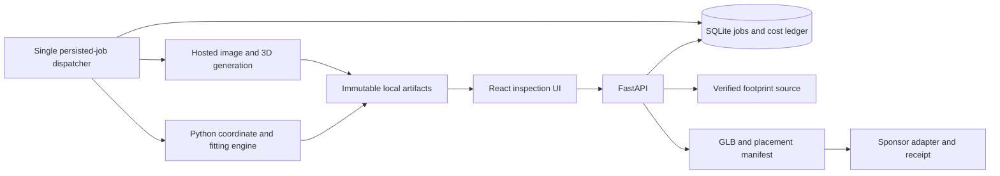

> **Reference and post-hackathon backlog.** About 16 elapsed hours remain, with AI doing most of the implementation. Follow [the active AI-assisted plan](implementation-plan.md). The larger architecture, person-hour estimates, and extensive tests below are not requirements for this submission. Retained for research citations, geometry derivations, and later development.

# Implementation plan: stack, budget, and research-backed decisions

Planning update: September 19, 2026. Read alongside [the feasibility review](feasibility-plan.md), which defines coordinate conventions, transforms, sponsor evidence, and geometric counterexamples. This document makes the implementation choices and spending assumptions concrete. Nothing described below has been implemented or purchased.

**Recommendation:** React/TypeScript/Three.js for inspection; Python/FastAPI with Shapely, pyproj, trimesh, NumPy, and SciPy for geometry; SQLite and local artifacts initially; one hosted generation provider. Build around one verified simple building. Budget **$20 for a local demonstration, approximately $25–35 for a modest hosted demonstration, and a proposed $50 cash ceiling**, conditional on verifying the generation account's API credit entitlement. Reserve **16–26 person-hours** for the complete core. Reliable asset generation and sponsor access are the main feasibility gates.

Team size, cash limit, credits, preferred languages, photographs, and sponsor access remain unconfirmed. Scheduling examples assume two contributors with relevant web/Python experience. The $50 ceiling is a planning assumption, not authorization to spend. Prices below are USD before taxes; discounts and sponsor credits are excluded from the baseline.

## 1. Scope and decisions

| Decision | Selected approach | Reason / boundary |
| --- | --- | --- |
| Main deliverable | Photo → styled concept → genuine generated GLB → automatic placement → reproducible export → verified sponsor handoff | A cached genuine generation supports a reliable presentation; world integration remains a separate acceptance gate |
| Supported geometry | One detached, approximately rectangular building; one selected polygon without holes | Makes geometry quality and uniform containment tractable within the event |
| Geographic area | One verified county/sponsor dataset | Address search across arbitrary municipalities requires more adapters and identity handling |
| Scale policy | Uniform XYZ scale first | Preserves proportions and avoids affine export complications |
| Ground | Flat local ground, explicitly assumed | Footprints provide no measured terrain elevation |
| Heading | Four OBB candidates, then a small bounded refinement if needed; independent front-direction review | Footprint symmetry cannot determine facade direction |
| Generation | Meshy adapter, contingent on a successful sample and account check | One provider can cover image editing and textured mesh generation |
| Hosting | Laptop first; one persistent CPU service if a public interactive backend is needed | Removes hosting from the initial geometry experiment |
| Interaction | Orbit inspection and raw/fitted toggle | Character navigation follows successful placement and handoff |
| Excluded from core | Training, local GPU inference, interiors, global terrain, unrestricted public generation, extra sponsor products | These add independent failure modes and cannot be justified by the core budget |

Success means an inspectable placement of a generated approximation. It does not establish that the invisible facade, roof construction, height, or internal layout matches the real building.

## 2. Concrete technology stack

| Layer | Choice | Responsibilities and implementation constraints |
| --- | --- | --- |
| Frontend | React + TypeScript + Vite | Single-page upload/selection/review flow. No server rendering requirement. Prefer familiar styling with a small component set |
| 3D scene | Three.js through React Three Fiber; Drei for loader/orbit controls | GLB, ground grid, north arrow, target polygon, fitted proxy, bounds, dimensions. Use plain Three.js instead if the team already knows it; choose one scene ownership model |
| UI state | React state/reducer and ordinary HTTP polling | One job at a time needs no additional global-state or websocket service |
| API | FastAPI + Pydantic + Uvicorn; HTTPX for provider/GIS calls | Typed requests/responses, upload validation, stage transitions, errors, export, operator-only generation |
| Polygon geometry | Shapely | Validation, OBB, hull, intersection, union, containment, holes, collision and clearance |
| Coordinate conversion | pyproj / PROJ | Explicit source CRS, WGS84 conversion, shared local frame; log datum/accuracy assumptions |
| Mesh measurements | trimesh + NumPy | Traverse scene transforms, measure geometry, inspect connected components, slice triangles. Keep original GLB bytes for display/export |
| Optimization | SciPy `linprog(method="highs")` | Largest contained uniform fit for a fixed heading and convex target; explicit translation bounds |
| Persistence | Standard-library SQLite + filesystem | Job states, provider IDs, artifact hashes, placement versions, budget ledger; single host and one job dispatcher |
| Worker | One restartable Python dispatcher with persisted work in SQLite | Serial paid submissions, polling/backoff, atomic artifact downloads; CPU fitting runs outside the API event loop |
| Deployment | One CPU container with persistent volume, provisionally Railway | Serve the built frontend and API from one origin. One replica; both SQLite and artifacts live on the mounted volume |
| Optional artifact hosting | Cloudflare R2 Standard | Add only when public asset distribution or storage volume warrants it; configure CORS and cache immutable hashes |
| Verification | pytest for geometry/workflow; one browser export/reload smoke test | Concentrate on unit/axis mistakes, containment, duplicate spending, restart recovery, and placement equivalence |

Start with a mutually compatible dependency set and commit exact lockfiles after the first install and GLB-load smoke check. Do not choose package versions by memory. A supported Node LTS and Python 3.12 are reasonable starting environments, subject to wheel/package compatibility at setup.

Shapely's [minimum rotated rectangle](https://shapely.readthedocs.io/en/stable/reference/shapely.minimum_rotated_rectangle.html), trimesh's [mesh-section operations](https://trimesh.org/section.html), and SciPy's [linear-programming interface](https://docs.scipy.org/doc/scipy/reference/generated/scipy.optimize.linprog.html) cover the essential numerical operations. Application code must still define tolerances, frames, failure states, and policies.

### Alternatives and when to choose them

| Alternative | Benefit | Decision |
| --- | --- | --- |
| All TypeScript | One language and simpler deployment | Reasonable for a team with existing GIS tooling; otherwise Python's geometry libraries reduce custom numerical work |
| Next.js frontend/server | Useful when an existing app requires its routing or server features | No clear benefit for this empty repository's single 3D inspection page |
| Supabase/Postgres/PostGIS | Shared state, richer geographic queries, multiple workers | Defer until concurrency or geographic querying exceeds the selected-building demo |
| Redis/Celery | Distributed queue and worker coordination | Defer; persisted single-worker orchestration is sufficient for one operator |
| MapLibre basemap | Better geographic context | Optional after correct local placement; a grid, north arrow, footprint, and recorded source are enough for the core inspection |
| Local open model | More generation control and potentially lower marginal cost at scale | Use only if a working GPU environment already exists; see research and budget sections |



The diagram shows logical responsibilities, not a requirement to deploy separate services. The core fits in one container/laptop application with an API process and a worker process.

## 3. Budget and spending feasibility

### Verified price inputs and unresolved account details

Meshy's plan comparison lists **Pro at $20/month with 1,000 monthly credits and API access**. Its API help states that the free plan has no API access, even after buying extra credits. The generic API pricing page also describes prepaid API usage. Therefore, verify the actual account's API-usable balance and checkout before relying on the subscription allocation; neither an existing web balance nor free credits is sufficient proof. Promotional pricing is excluded. [Plan comparison](https://help.meshy.ai/en/articles/12062933-which-meshy-plan-is-right-for-you-free-vs-pro-vs-premium-vs-ultra), [API access and task billing](https://help.meshy.ai/en/articles/16815622-how-many-credits-does-each-meshy-api-task-cost).

The published API table lists image editing at **3–12 credits**, standard textured Meshy-6/7-family image-to-3D at **30 credits**, and remeshing at **5 credits**. Higher geometry/texture settings can cost more. Pin settings in the job record and cost calculator; do not silently use a changing provider default. [Meshy API pricing](https://docs.meshy.ai/en/api/pricing).

### Generation allowance

Use a conservative allowance of 42 credits per full attempt: one 12-credit edit plus one 30-credit textured mesh. Reusing an accepted concept can lower consumption, but savings are not required for the plan to work.

| Purpose | Maximum planned operations | Credit allowance |
| --- | --- | ---: |
| Main-building experiments | 6 full attempts | 252 |
| Backup asset / second photo | 2 full attempts | 84 |
| Rehearsal and live demonstration | 2 full attempts | 84 |
| Optional mesh reduction | 2 remesh calls | 10 |
| Planned total | 10 full attempts + 2 remeshes | **430** |
| Contingency within application cap | Additional work only after inspecting failure cause | **170** |
| Proposed application credit cap | Planned + contingency | **600** |

At the low edit price, ten full attempts plus two remeshes use 340 credits; at the high edit price, 430. These are spending allowances, not predictions that ten attempts will produce ten usable buildings.

If the account confirms 1,000 applicable credits for $20, the allocated value is $0.02/credit, or approximately $0.66–0.84 per full attempt. **Cash outlay is still $20**, not the allocated value of credits actually consumed. A completed but architecturally unusable model must be treated as paid work; do not assume visual dissatisfaction qualifies for a refund. [Credit/refund policy](https://help.meshy.ai/en/articles/15643245-when-were-my-meshy-credits-used-or-refunded).

### Cash scenarios

| Scenario | Generation | Infrastructure | Expected initial cash | Feasibility |
| --- | ---: | ---: | ---: | --- |
| Sponsor credits and local demo | $0 if credits/access are actually supplied | $0 incremental, using existing laptop | **$0** | Conditional; sponsor credits are not confirmed |
| Self-funded local demo | $20 Pro, conditional on API balance | $0 incremental | **$20** | Recommended starting point |
| Hosted demo | Same $20 generation assumption | Allocate $5–15 for one CPU host/volume | **$25–35** | Recommended if a live public backend is required |
| Proposed ceiling | Generation and hosting above | Preserve up to $15 of a $50 envelope for unexpected charges | **$50 maximum planned** | Stop or revise scope if actual checkout/usage exceeds the envelope |

These figures cover the initial subscription/billing period, not indefinite hosting. They exclude tax, hardware purchases, travel, and labor. Existing account usage reduces remaining credits and free-tier capacity. If API credits must be purchased separately, obtain the actual pack price and recompute the cash total; no verified dollar-per-credit top-up price is assumed here.

Railway publishes a **$5 monthly Hobby minimum that includes $5 of usage**, with usage above that billed additionally; it is not $5 plus the same $5 of compute. Published service rates include $0.00000386/GB-second RAM, $0.00000772/vCPU-second CPU, $0.00000006/GB-second volume, and $0.05/GB egress. For an illustrative 48 hours at 1 GB RAM, 0.1 average active vCPU, a 1 GB volume, and 5 GB egress, resource cost is about **$1.06**, so the plan minimum dominates. This is an assumed workload, not measured memory demand; cap the service and monitor it. [Railway pricing](https://railway.com/pricing).

R2 Standard includes 10 GB-month storage, 1 million Class A operations, and 10 million Class B operations monthly; direct egress is free. As a workload example, twenty 50 MB assets occupy about 1 GB, and 100 complete downloads of a 50 MB GLB transfer about 5 GB. Those volumes fit the stated free allocation if the account has no competing usage; use **$0 expected incremental R2 cost** for this example, not unlimited free hosting. [R2 pricing](https://developers.cloudflare.com/r2/pricing/).

### Controls that make the budget credible

1. Keep generation operator-only; public visitors can inspect cached samples without launching paid tasks.
2. Persist a submission intent and reserved credits before the network request; permit one paid submission at a time.
3. Cache by input-content hashes, prompt, provider, model, and all generation settings. An intentional new variant requires an explicit new attempt identifier.
4. Enforce `confirmed_spend + reserved_or_uncertain_spend + next_call_estimate <= credit_cap` in a transaction.
5. Store the provider task ID immediately. If submission times out after possible acceptance, mark it `submission-unknown` and retain its reservation. Reconcile through supported provider history/idempotency; otherwise require operator review. Blind resubmission can double-charge.
6. Distinguish a refunded provider failure from a successful but unusable output. Release reservations only after reconciliation, and retain the history.
7. Download successful artifacts, verify them, hash them, and retain local copies; expiring provider URLs are not durable storage.
8. Configure a host usage limit where supported and record the subscription renewal dates in the handoff. Reassess spend after the event.

### Why local inference is not automatically cheaper

TRELLIS.2's official environment requires an NVIDIA GPU with at least 24 GB memory and CUDA build dependencies; its example performance figures are measured on H100. Hunyuan3D-2.1 documents 10 GB for shape generation, 21 GB for texturing, and 29 GB for the combined workload. These requirements exclude an assumed ordinary laptop deployment. [TRELLIS.2 repository](https://github.com/microsoft/TRELLIS.2), [Hunyuan3D-2.1 repository](https://github.com/Tencent-Hunyuan/Hunyuan3D-2.1).

Compare an actual GPU quote using `rental rate × (setup + downloads + warm-up + active inference + idle time) + storage + transfer`, then add implementation time. No current GPU-rental quote has been selected. An already-working sponsor GPU changes this decision; a free code repository alone does not.

## 4. Recent research translated into implementation choices

The following sources inform the design; none has been reproduced on this building. Paper benchmark quality is not evidence of reliable architecture reconstruction in our pipeline. Dates identify the specific work, rather than asserting that it is the newest or best available model.

| Research | What the source establishes | Decision for this project | What remains unproven |
| --- | --- | --- | --- |
| [VGGT, CVPR 2025](https://arxiv.org/abs/2503.11651) | Predicts cameras, depths, point maps, and tracks from one or multiple views | Candidate for a later reconstruction path using several consistent real photographs; retain real views now | Does not itself deliver our styled, textured, cleaned, GIS-aligned GLB. Fast network inference is not total workflow latency |
| [SAM 3D, November 2025](https://arxiv.org/abs/2511.16624) | Generates object geometry, texture, and layout from real images, including cluttered/occluded scenes | Supports testing object-isolated inputs; crop/mask the selected building and retain the mask as provenance | Plausible completion of hidden surfaces does not validate facade dimensions or geographic position |
| [TRELLIS.2, 2025 technical report and official code](https://github.com/microsoft/TRELLIS.2) | Image-conditioned generation with structured latent geometry and PBR attributes | Possible alternative if an existing working service/GPU is available; use the same GLB import and acceptance contract | Object-generation results do not establish correct building topology, scale, or game compatibility |
| [SiZeUp, August 2026 manuscript](https://arxiv.org/abs/2608.22821) | Uses known footprints, a height parameter, calibrated oblique aerial imagery, and ordinal depth consistency for urban proxies | Supports investigating a geometry-first, footprint-extrusion fallback with explicit height provenance | We do not have its calibrated aerial inputs; a street-photo extrusion is not a reproduction of the method or its reported performance |
| [Pix2Poly, WACV 2025](https://openaccess.thecvf.com/content/WACV2025/html/Adimoolam_Pix2Poly_A_Sequence_Prediction_Method_for_End-to-End_Polygonal_Building_Footprint_WACV_2025_paper.html) | Learns polygonal building footprints from remote-sensing imagery | A possible future source where GIS coverage is missing; keep the county polygon for this demo | A predicted footprint is not an authoritative GIS record, and this is different from extracting a base from a generated mesh |

Our engineering inference is to spend scarce time on **measurement, constraints, provenance, and rejection of bad outputs**. Reproducing or fine-tuning these systems would change the project into a research effort. If fidelity becomes more important than the sponsor's specified concept-before-mesh sequence, investigate reconstruction from real multi-view images followed by retexturing as a separate product direction.

## 5. Hard parts and established results

### 5.1 What one photograph can and cannot identify

For a pinhole camera, projected coordinates depend on ratios such as `X/Z`. Scaling scene dimensions and camera translation together preserves those image ratios. A single uncalibrated image therefore cannot uniquely determine metric scale. Invisible surfaces also admit multiple geometries with the same observed image. A learned prior can select a plausible solution; that is an estimate rather than new measurement.

**Implementation consequence:** GIS establishes a plan-scale constraint, a height record establishes a separate height constraint, and a front-edge hint establishes an orientation constraint. Track their provenance independently. Report `height=inferred` and `heading=ambiguous` when those inputs are absent. A high IoU does not resolve these unknowns.

**First experiment:** use one real three-quarter photograph and the selected footprint. Spend at most four mesh attempts in the first feasibility block, comparing original and styled input as necessary. Inspect volume, base, roof, aspect ratio, topology, and textures. If every attempt fails structurally, improve the input/change the building or declare the generation gate unmet before adding UI features.

### 5.2 Footprint extraction needs triangle geometry

A triangle can cross a horizontal plane without any vertex lying near that plane. Low-vertex filtering consequently misses legitimate walls. Use triangle-plane intersections to construct section loops; trimesh already exposes [section and multi-section operations](https://trimesh.org/section.html).

Proposed implementation sequence:

1. Traverse all nodes and apply their source-to-asset-root transforms to measurement copies; keep the original render asset untouched.
2. Review obvious ground slabs/background components before using extrema. Component size alone is not a semantic classification rule.
3. For the simple first asset, use a projected convex hull only as a **conservative proxy**, labeled `projected-hull`; do not call it the true wall footprint.
4. If that proxy causes material overhang mismatch, try horizontal sections at several configurable offsets above the reviewed base, for example 2%, 5%, and 10% of model height.
5. Assemble closed rings with explicit tolerance and compare sections. An initial heuristic can require pairwise IoU ≥ 0.9 among the selected consistent sections; log sensitivity rather than treating the threshold as a research result.
6. Preserve holes and components. Open loops, unstable sections, or abrupt base changes produce `needs-review`, not an invented closed footprint.

Keep `Q_fit`, `Q_visual`, and `Q_collision` separate. A stable hull can still be the wrong wall estimate; proxy confidence must remain visible even after a geometrically successful fit.

### 5.3 OBB gives a finite set of useful initial orientations

The minimum-area enclosing rectangle of a convex polygon has a side collinear with a hull edge. Rotating calipers exploits this to find the rectangle after computing the convex hull. This is a known geometric result, not a learned estimate. [Toussaint, *Solving Geometric Problems with the Rotating Calipers*](https://cgm.cs.mcgill.ca/~godfried/publications/calipers.pdf).

Use Shapely's implementation and canonicalize its corner ordering. PCA answers a different least-squares spread problem and is not a drop-in minimum-area-box solver. Reject degenerate line/point results.

OBB gives initialization, not a proof that the generated shape fits the true polygon. Start with four candidate headings. If required, add offsets from −10° to +10° in 2° increments around each: at most 44 candidates before deduplication. These are proposed search limits; they do not guarantee the globally best yaw.

**Symmetry limit:** a rectangular footprint cannot distinguish 0° from 180°; a square can leave four equivalent orientations. Keep equivalent alternatives and use a supplied facade direction or manual selection to resolve facing. Repeated optimization cannot recover missing information.

### 5.4 Solve translation and scale exactly for each convex candidate

The earlier feasibility plan derives the convex containment formulation. Make it the primary solver, rather than writing a general mesh-registration optimizer.

Let a convex target be `P = {p : n_i · p <= b_i}` with outward unit normals. At fixed heading β and canonical source footprint Q, compute `h_i = max(q in Q) n_i · R(β)q`. Then solve:

```text
maximize s
subject to n_ix * t_E + n_iy * t_N + h_i * s <= b_i - margin_i
           s >= s_min > 0
```

This is a three-variable linear program in `(t_E, t_N, s)`. The equivalence follows directly by taking the maximum of each containment inequality over all source points. It works for a nonconvex source inside a convex target because each half-space depends only on the source support value. It does **not** make a concave target convex.

Implementation details that prevent subtle errors:

- SciPy minimizes, so use objective `[0, 0, -1]`. Set bounds `[(None, None), (None, None), (s_min, None)]`; default nonnegative bounds would wrongly forbid negative translations.
- Normalize normals before applying a margin in meters. Use local double-precision coordinates.
- Derive `Q` from the canonical source in the existing `K` transform; retain the same asset-root matrix for rendering/export.
- Inspect solver status and residuals. Recompute containment with Shapely on the actual transformed polygon; solver success alone is not acceptance.
- Among equal-scale solutions, apply a deterministic secondary preference for translation close to the target OBB center without materially reducing scale.
- Keep numerical tolerance distinct from GIS uncertainty. For example, `P.buffer(epsilon_numeric).covers(Q_fitted)` can implement a documented numerical allowance; it cannot turn uncertain GIS into accurate wall measurements.

[SciPy's `linprog` documentation](https://docs.scipy.org/doc/scipy/reference/generated/scipy.optimize.linprog.html) specifies objective, inequality, variable-bound, and solver-status handling. The containment formulation above is our application-specific derivation. Its guarantee is the largest feasible uniform scale **at a fixed heading for the modeled convex target**, subject to solver tolerance, not a globally optimal arbitrary-building fit.

If `P` has meaningful concavity, holes, or multiple components, the first implementation returns review/rejection after measuring any proposed placement against the real P. Do not replace P with its convex hull and label the result accepted. General concave optimization is explicitly outside the first solver.

### 5.5 Use registration algorithms only for the problem they solve

[Umeyama's 1991 result](https://web.stanford.edu/class/cs273/refs/umeyama.pdf) provides a least-squares similarity transform for corresponding point pairs. It is useful if a later review tool lets a user identify matching footprint corners. Pair correspondence and sufficient geometric variation are essential; unordered polygon vertices are not correspondences. Least-squares optimality is not robustness to outliers or proof of containment.

ICP is useful as local alignment refinement when compatible point sets already roughly align. [Open3D's registration documentation](https://www.open3d.org/docs/latest/tutorial/pipelines/global_registration.html) explicitly distinguishes local methods requiring initialization from global registration. For our task, nearest-point error does not encode courtyard preservation, spill limits, or facade identity. Therefore ICP is not a core dependency; any future refinement must pass the same polygon constraints afterward.

### 5.6 Recognize impossible fits before spending more time

Two useful analytical checks from the feasibility review should become visible diagnostics:

- **Aspect mismatch:** for centered, aligned filled rectangles under uniform containment, maximum coverage is `min(r_mesh/r_target, r_target/r_mesh)`. A 2:1 asset in a 3:1 target can cover at most 2/3 in that orientation. A target IoU of 0.85 is impossible under those assumptions without changing geometry/proportions.
- **Topology mismatch:** an invertible affine transform preserves connectedness and holes; it also maps a convex set to a convex set. It cannot add missing wings to a convex box or create a courtyard. Regeneration, a different asset, or a separately labeled procedural model is required.

These facts justify a review/rejection path. They do not justify silently raising anisotropy or lowering thresholds until every output passes.

### 5.7 Metrics and uncertainty must describe different questions

For each candidate record IoU, coverage, spill area/fraction, dimensions, scale, heading, base policy, proxy policy, neighbor intersections, and origin/CRS. Use a containment predicate as the acceptance check. A sampled maximum exterior-distance display must be labeled approximate; test coverage/holes with actual polygons rather than only sample points.

Proposed demo acceptance remains IoU ≥ 0.85, containment within documented numerical tolerance, no neighbor overlap, stable extraction, and uniform scale. Preserve independent identity/heading/height/terrain/world-link states. The threshold is a product policy to evaluate on samples, not a statistically calibrated confidence level.

When GIS uncertainty is known, compare metrics across plausible documented boundary perturbations and flag threshold-sensitive decisions. Never convert a convenient tolerance into a claim of survey accuracy.

## 6. Buildable modules and durable data contract

Proposed repository layout; these application files do not yet exist:

```text
web/src/
  App.tsx
  api/client.ts
  components/JobForm.tsx
  components/FootprintPicker.tsx
  components/PlacementReview.tsx
  scene/BuildingScene.tsx
server/app/
  main.py                 # HTTP routes and input validation
  schemas.py              # versioned job/placement/export models
  repository.py           # SQLite transactions and restart state
  worker.py               # one durable dispatcher
  providers/meshy.py
  providers/gis.py
  providers/world.py      # actual sponsor contract, when supplied
  geometry/frames.py
  geometry/mesh.py
  geometry/footprints.py
  geometry/fit.py
  geometry/metrics.py
  exports.py
server/tests/
  test_frames_and_export.py
  test_containment.py
  test_job_recovery.py
fixtures/                # small synthetic assets and provenance-safe samples
data/                    # ignored runtime DB/artifacts; persisted volume in deployment
```

Use the existing feasibility plan's endpoints and manifest fields, with these operational additions:

| Record | Required additional fields |
| --- | --- |
| Job | `jobId`, `schemaVersion`, selected building feature, independent stage states, `currentPlacementVersion`, created/updated timestamps |
| Generation attempt | Input hash, provider/model/settings, deduplication key, submission intent, task ID, expected/reserved/reconciled credits, timestamps, error details |
| Artifact | Relative or object-storage URI, SHA-256, byte count, media type, provider source, acquisition time, ready/partial state |
| Fit result | Input asset/footprint hashes, algorithm version, local frame, candidate scores, matrix storage order, proxy type, policy/tolerance values |
| Review action | Previous/new values, placement version, timestamp, reason; refit before committing export |
| World registration | Adapter version, request fingerprint, pending/failed/confirmed state, external receipt ID and reload evidence |

SQLite stores metadata and paths, not large GLB blobs. Write downloads to temporary files and atomically promote them only after validation. A worker lease/restart scan resumes polling existing tasks; a browser refresh must never start a second generation. Keep a single dispatcher and deployment replica until a shared transactional store is introduced.

Generation status should show real stages and timestamps, including `submission-unknown` and `needs-review`; it must not display fabricated percentages. A fitted result becomes immutable by version so a stale browser cannot export a matrix for a different asset.

## 7. Execution order, effort, and stop conditions

The earlier 11–20 person-hour estimate was optimistic about orchestration and integration. This breakdown budgets **16–26 person-hours** for a tested core; it still assumes familiar tools and a simple accessible sponsor API. Unknown access or repeatedly unusable generation can extend it indefinitely.

| Work package | Dependencies | Effort | Evidence required to finish |
| --- | --- | ---: | --- |
| A. Feasibility gate | Photos, selected building, account access | 1–2 h | Verified target polygon, downloaded textured GLB, actual credits/latency recorded, sponsor contract or explicit blocker |
| B. Geometry and export | Coordinate contract; can begin with fixtures | 5–7 h | Scene-node transforms, local frame, convex solver, metrics, hash-bound manifest; fixtures and round-trip pass |
| C. Inspection frontend | Fixture contract; then real B output | 3–5 h | Source/concept/GLB, footprint, raw/fitted toggle, dimensions/matrix, ambiguity controls, errors |
| D. Provider and durable jobs | Successful A sample and schemas | 3–5 h | Image edit → mesh, safe submission, credit ledger, artifact caching, refresh/restart recovery |
| E. Sponsor handoff | Actual API/format; validated export | 1–3 h | Accepted asset/placement, stored external ID, independent reload |
| F. Package and verify | All core paths | 3–4 h | Real sample + rejected sample, offline fallback, deployed/local reload, submission materials, rehearsal |
| Optional exterior navigation | Core accepted and exported | +2–3 h | Swept collision, reset, camera obstruction, stable frame rate |

For two experienced contributors, a roughly 10-hour working block can cover the lower-to-middle part of the core estimate if B and C proceed concurrently while generation runs. This is a staffing example, not a commitment about the unconfirmed team. One person with 6–10 hours should target a genuine cached GLB, deterministic placement, export, and clear completion boundaries. Four people improve separation of viewer, geometry, integration, and demo preparation, but cannot remove API or generation latency.

Suggested checkpoint sequence:

1. **T+0 to 90 minutes:** choose the building, verify account and footprint, start a bounded real-sample experiment; freeze the scene/matrix contract. If API access fails, continue the fixture path and label fresh generation unavailable.
2. **T+90 minutes to 4 hours:** geometry module and viewer operate on the same fixture; prove orientation, scale, and manifest round-trip. Inspect the real model as soon as it arrives.
3. **T+4 to 6 hours:** real asset fits and is inspectable; connect durable generation and budget accounting. If the model cannot meet the fit gate, fix the input or select the verified backup rather than broadening the optimizer.
4. **T+6 to 8 hours:** sponsor import and persisted reload, review controls, cost/restart checks. Add navigation only if this is complete.
5. **Final two hours before submission:** freeze functionality, validate cached demo, record fallback, prepare submission and rehearse. Use the earlier review's conservative 8:00 AM submission / 9:00 AM readiness schedule unless organizers provide a newer instruction.

Fallbacks are distinct completion levels:

| Outcome | What can be honestly demonstrated |
| --- | --- |
| Generation and sponsor integration succeed | Complete selected-building pipeline with cached result and resumable live jobs |
| Generation succeeds; sponsor unavailable | Map-ready asset, placement manifest, viewer; world integration incomplete |
| Only a previously generated asset is usable | Genuine cached generation plus automatic placement; current live generation incomplete |
| No usable generated asset | Labeled footprint extrusion and deterministic fitting diagnostics; image-to-3D milestone incomplete |

## 8. Small experiment suite that changes decisions

Run geometry fixtures without spending API credits. The following are proposed tests and experiments, not measured results from an implementation.

| Case | Expected behavior | Failure means |
| --- | --- | --- |
| Known transformed box, including nested node transforms | Recover dimensions/grounding; reproduce placed vertices after export/reload within 1e-6 m on small synthetic fixtures | Unit, matrix, hierarchy, or serialization bug |
| Rectangle with matching aspect ratio | Uniform fit with IoU near 1 and no spill | Basic fitting incorrect |
| 2:1 rectangle into a 3:1 rectangle | Best aligned uniform coverage 2/3; useful underfill review | Hidden stretching or invalid expectations |
| L-shaped / courtyard target | Core convex solver declines; polygon metrics reveal spill/hole conflicts | Hull replacement is masking topology mismatch |
| Square / symmetric footprint | Equivalent heading alternatives shown | Confidence reporting overclaims facade direction |
| Negative East/North translation | Valid placement remains feasible | Default LP bounds wrongly constrain translation |
| Generated slab or downward spike | Base/proxy warning; no silent acceptance | Grounding uses contaminated extrema |
| Timeout immediately after paid submission | Reservation retained; no blind second POST | Duplicate billing risk |
| Restart during polling / artifact download | Resume same task; partial files never served as complete | Job persistence incomplete |
| Input asset changes after fit | Old placement/export rejected or tied to its original version | Hash/matrix mismatch |
| Real building and real GLB | Meet selected plan-fit gate; disclose heading/height uncertainty; target ≥30 FPS on judging laptop | Scope/asset quality/performance problem |
| Sponsor import and fresh reload | Stored receipt and equivalent placement | Local export does not establish world integration |

For each real generation record source/concept hashes, model/settings, charged credits, queue and generation duration, download size, node/triangle counts, fitted dimensions, fit metrics, and acceptance reason. Measure **credits and elapsed time per accepted asset**, not just per API call. A beautiful model that fails placement still counts against the budget.

The first decision to resolve is whether one real asset passes this gate within the initial 90-minute experiment. Once that is established, deterministic geometry, export correctness, and actual sponsor compatibility should receive most of the remaining engineering time.
